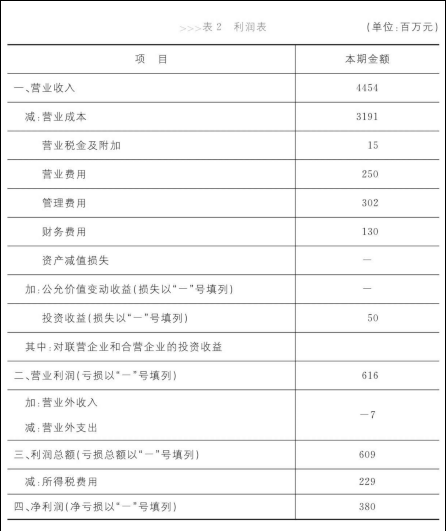

# 利润表——企业的摄像机

1. 毛利=营业收入-营业成本
2. 营业利润(Operating Profit)=毛利-营业税金及附加-营业费用-管理费用-财务费用-资产减值损失+投资收益+公允价值变动收益
    - 营业税金及附加(Buasiness Tax and Surcharges)
        - 包括营业税、消费税、城市维护建设税等等
        - 营业税(Business Tax)[^增值税]：国家按照营业额征收的税，属于流转课税。[^流转课税]
    - 费用(Expense)
        - 营业费用(Operating Expenses)
        - 管理费用(General and Administrative Expense)
        - 财务费用(Financing Expense)
    - 投资收益(Investment Income)
    - 资产减值损失(Impairment Loss of Assets Impairment)
    - 公允价值变动收益(Gains on the Changes in the Fair Value)
3. 利润总额=营业利润+营业外收入-营业外支出+补贴收入-汇兑收益
    - 营业外收入(Non-operating Revenues)[^营业外收入]
    - 营业外支出(Non-operating Expenses)
4. 净利润(Net Profit)=利润总额-所得税
    - 只能采用“净利润=利润总额-所得税”的方式得到净利润。如果所得税率25%，则净利润不一定是利润总额的75%。
    - 利润总额采用会计准则为基础计算得到，应税所得采用税法为基础计算得到。
    - 应纳税所得(Taxable Income)：企业所得扣除取得这些所得所发生的费用才是企业所得税的应纳税所得。
    - 应税利润(Taxable Profit)：根据税法规定所确认的收入总额与准予扣除项目金额的差额。

[^增值税]: 增值税是销售税，是消费者承担的税费，属于累退税。增值税是价外税(Tax Excluded in Price)，而营业税是价内税(Tax Included in Price)。通常卖方已经替税务局从消费者手中收取了增值税，并且卖方有义务将其上缴税务局。
[^流转课税]: 常见的流转税有营业税和增值税。
[^营业外收入]: 典型特点就是不可持续性。另外还有汇兑损益，中国特色还有补贴收入。

利润表透露了两个信息

- 企业是否赚钱
- 企业在哪里赚的钱
    - 分开显示可持续利润与不可持续利润

利润表是一个时间段的概念。
